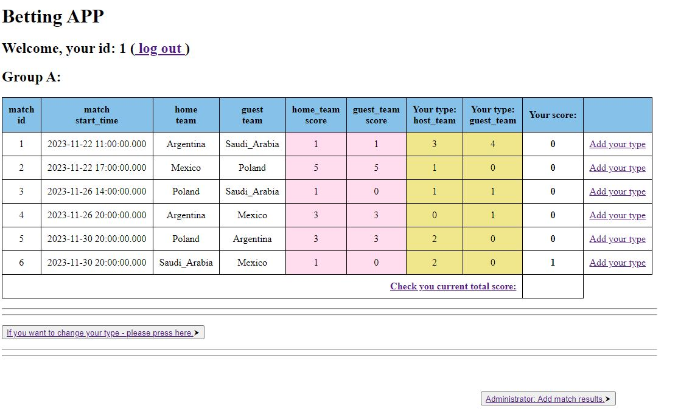

# Project Name
> Final Project - A flask application for betting on match results.
## Table of Contents
* [General Info](#general-information)
* [Technologies Used](#technologies-used)
* [Features](#features)
* [Screenshots](#screenshots)
* [Setup](#setup)
* [Usage](#usage)
* [Project Status](#project-status)
* [Room for Improvement](#room-for-improvement)
* [Acknowledgements](#acknowledgements)
* [Contact](#contact)
<!-- * [License](#license) -->
## General Information

A web application that allows users (with personalized accounts) to place bets on the results of selected sports tournaments.

Users, after logging into their accounts, have the option to place bets on the results of active matches. These results are saved to the database.

After the end of the match, the data controller imports the match results to the program, and the user has the option to check the number of points obtained from his prediction (3 points for a correct result, 1 point for indicating the correct winner or tie, 0 in other cases).

The user can read the number of points obtained in a given tournament among all his predictions.

- It is not possible to place bets on matches after their start time.

- It is not possible to duplicate the results of bets.

- Meeting results can only be added by a user with administrator privileges.

- User accounts have their own login and password (hashed).

<!-- You don't have to answer all the questions - just the ones relevant to your project. -->
## Technologies Used (min. version of the software)

- Python - version 3.9
## Features
List the ready features here:
- For defined users - the ability to log in to your own results type management panel.

- Generation of types saved in the database for individual meetings by individual users.

- The ability to read the scores scored - for the moment.

## Screenshots

<!-- If you have screenshots you'd like to share, include them here. -->
## Setup
The program runs on the base:

- PyCharm application library

- Requests library

- Flask library 

- Jinja2 library

- Werkzeug library

- SQLite3

## Usage
How does one go about using it?
- pip install -r requirments.txt

- Step one create data with file "teams_base_create.py" from directory "00_Database"

- Next run file "Final_Project.py"

## Project Status
Project is:  _beginning of program development_ . 

## Room for Improvement
- Ability to create a new user account.

- Adding new tournaments (databases).

- Adding new appointments.

- Adding betting parameters (e.g. goals scored in the first half, goal scorer).

- Showing results as a comparison between players (sorting results).

- Graphical graphs of points scored by players over time.

- Graphical chart of points scored by individual players (throughout the tournament).

- Ability to generate a tournament tree.

## Acknowledgements

- This project was based on book : "Flask Web Development: Developing Web Applications with Python, 2nd Edition " Miguel Grinberg.

- Many thanks to Alek Gruszczyński for being patient and watching over the proper direction of this application.

## Contact
Created by Maciej Cieszynski. 

Feel free to contact me (https://www.linkedin.com/in/maciejcieszynski/)!

<!-- Optional -->